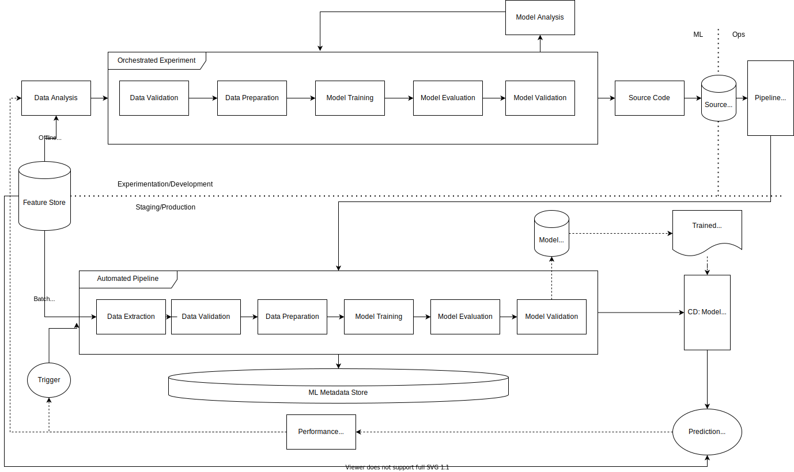
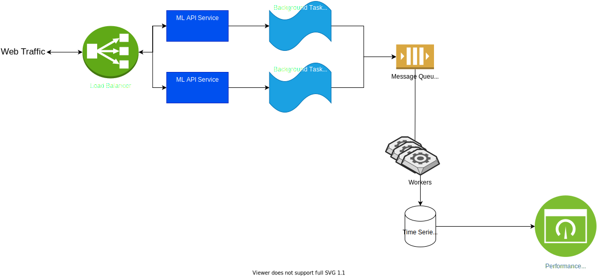

# MLOps
Cloud agnostic tech stack for an MLOps platform

"We'll build a pipeline - after we deploy the model."


```Model drift will hit when it's least convenient for you```

# TODOs
Docker Compose:
- [x] Install & Configure Airflow 2.0 service
- [x] Write dummy retrain DAG
- [x] Test stable Airflow REST API from postman
- [x] Configure MLFlow connection to postgresql
  - [x] mlflowdb is NOT getting created on postgresql start up
- [x] Create bridge "server" to POST to Airflow rest API, simple flask app will work
- [x] Prometheus integration with FastAPI for service metrics
  - [x] Config scrape intervals and metrics
- [x] RabbitMQ for distributed tasks
- [x] RabbitMQ workers to pull from queue and write to InfluxDB
- [x] InfluxDB to record features and predictions
- [x] Locust for load testing and simulating production traffic
- [ ] Google Feast Feature Store started
- [ ] Amundsen for Feast UI?
- [x] ML Monitoring
    - [x] Create Grafana dashboard:
        - [x] Model specific metrics
          - [x] Feature distributions (InfluxDB)
          - [x] Predictions (InfluxDB)
        - [x] RabbitMQ queue depth (Prometheus)
        - [x] Service metrics
          - [x] Request Latency (Prometheus)
          - [x] Request Throughput (Prometheus)
  - [x] Webhook on alarm condition POST to bridge server
- [ ] K8S Deployment


__To run__:
Make sure docker is running and you have [Docker Compose](https://docs.docker.com/compose/install/) installed. 

1. Clone the project
    ```bash
    git clone https://github.com/jmeisele/ml-ops.git
    ```
2. Change directories into the repo
    ```bash
    cd ml-ops
    ```
3. Run database migrations and create the first Airflow user account.
    ```bash
    docker-compose up airflow-init
    ```
    user: _airflow_

    password : _airflow_
4. Build our images and launch with docker compose
    ```bash
    docker-compose pull && docker-compose up
    ```
5. Send a POST request to our model service API endpoint
    ```bash
    curl -v -H "Content-Type: application/json" -X POST -d
    '{
        "median_income_in_block": 8.3252,
        "median_house_age_in_block": 41,
        "average_rooms": 6,
        "average_bedrooms": 1,
        "population_per_block": 322,
        "average_house_occupancy": 2.55,
        "block_latitude": 37.88,
        "block_longitude": -122.23
    }'  
    http://localhost/model/predict
    ```
6. You can also start the utility ```send_data.py``` which sends a POST request every 0.1 seconds
7. If you are so bold, you can also simluate production traffic using locust, __but__ keep in mind you have a lot of services running on your local machine, you would never deploy a production ML API on your local machine to handle production traffic. 

## Platform Architecture


## Model Serving Architecture


## Services
- nginx: Load Balancer
- python-model-service1: FastAPI Machine Learning API 1
- python-model-service2: FastAPI Machine Learning API 2
- postgresql: RDBMS
- rabbitmq: Message Queue
- rabbitmq workers: Workers listening to RabbitMQ
- locust: Load testing and simulate production traffic
- prometheus: Metrics scraping
- mlflow: Machine Learning Experiment Management
- influxdb: Time Series Database
- chronograf: Admin & WebUI for InxfluxDB
- grafana: Performance Monitoring
- redis: Cache
- airflow: Workflow Orchestrator
- feast: Feature Store
- bridge server: Receives webhook from Grafana and translates to Airflow REST API

If you found this repo helpful, a [small donation](https://www.buymeacoffee.com/VlduzAG) would be greatly appreciated. 
All proceeds go towards coffee, and all coffee goes towards more code.

## gotchas:

### Postgres:

_Warning: scripts in /docker-entrypoint-initdb.d are only run if you start the container with a data directory that is empty; any pre-existing database will be left untouched on container startup._